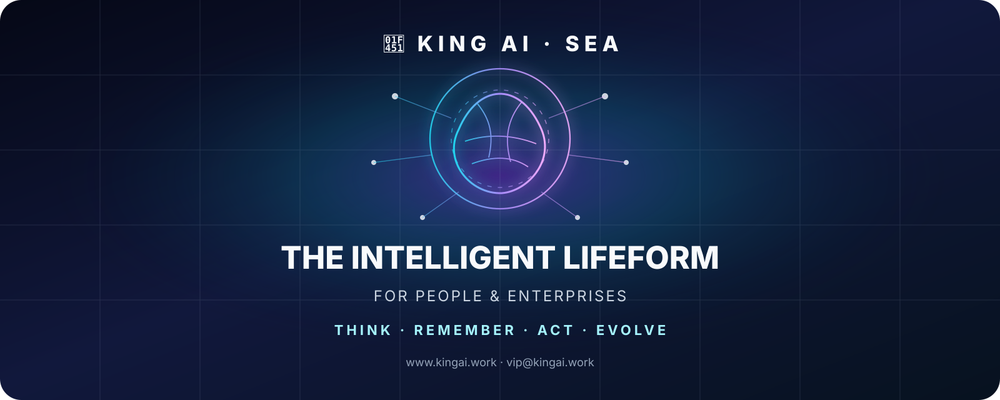

<div align="center">



# 👑 KING AI
## Intelligent Lifeform & Agent System
### Think · Remember · Plan · Coordinate · Act · Observe · Learn · Evolve · Govern

**Persistent intelligence for people, enterprises, developers and intelligent computing.**

🌐 https://www.kingai.work  
✉️ vip@kingai.work

[Ecosystem](ECOSYSTEM.md) · [Product Matrix](PRODUCT-MATRIX.md) · [Architecture](PUBLIC-ARCHITECTURE.md) · [Enterprise](business/ENTERPRISE-SOLUTIONS.md) · [Roadmap](ROADMAP.md)

</div>

---

# English

## KING AI

KING AI is a long-term intelligent-agent system designed around persistent memory, verified intelligence, mission planning, specialized AI roles, controlled action, interoperability and AI-native computing.

The unified core system is **KING AI SEA**.

```text
Understand → Remember → Plan → Coordinate → Act → Observe → Learn → Improve
```

## Ecosystem

| Project | Role | Status |
|---|---|---|
| KING AI SEA | Unified intelligent-lifeform / agent system | Active development |
| KING AI Intelligence | Research and technical analysis | Available |
| KINGAIBOT | Controlled execution layer | In Development · v1.2.0 foundation |
| KINGAI OS | AI-native Server / Desktop / IoT operating system | In Development · Pre-Alpha |
| KING AI Online Tools | 130+ bilingual browser utilities | Available / Live |
| KING AI Auth Lite | Free account and verified-email foundation | In Development |
| AI Workforce | Specialized enterprise AI roles | Custom-by-Scope |
| Personal Intelligence | Long-term personal intelligence | In Development / Custom-by-Scope |
| Developer & Integration | APIs, connectors and interoperability | In Development / Custom-by-Scope |

## Core Directions

- Persistent memory and continuity
- Knowledge and verified intelligence
- Mission planning and agent coordination
- AI Workforce and specialized digital roles
- Human-controlled execution
- Developer interoperability
- Model-neutral and local-first computing
- Enterprise and industry solutions

## Explore

- [Unified Ecosystem](ECOSYSTEM.md)
- [Product Matrix](PRODUCT-MATRIX.md)
- [Architecture](PUBLIC-ARCHITECTURE.md)
- [Enterprise Solutions](business/ENTERPRISE-SOLUTIONS.md)
- [Commercial & Strategic Partnerships](business/COMMERCIAL-PARTNERSHIPS.md)
- [Roadmap](ROADMAP.md)
- [KING AI Intelligence](intelligence/INDEX.md)
- [Documentation](docs/INDEX.md)
- [GEO Knowledge Graph](seo/GEO-KNOWLEDGE-GRAPH.md)

---

# 中文

## KING AI

KING AI 是一个长期发展的智慧生命体与智能体系统，围绕**长期记忆、可信情报、Mission 规划、专业 AI 岗位协同、受控行动、开发者互操作和 AI 原生计算**构建。

统一核心系统是 **KING AI SEA**。

```text
理解 → 记忆 → 规划 → 协同 → 行动 → 观察 → 学习 → 改进
```

## 生态体系

| 项目 | 定位 | 状态 |
|---|---|---|
| KING AI SEA | 统一智慧生命体 / 智能体主系统 | 持续开发 |
| KING AI Intelligence | 技术研究与智慧前沿 | 已可用 |
| KINGAIBOT | 受控终端执行层 | 开发中 · v1.2.0 基础 |
| KINGAI OS | AI 原生 Server / Desktop / IoT 操作系统 | 开发中 · Pre-Alpha |
| KING AI Online Tools | 130+ 中英文浏览器实用工具 | 已可用 / Live |
| KING AI Auth Lite | 免费账户与邮箱验证基础 | 开发中 |
| AI Workforce | 企业专业 AI 岗位体系 | 按项目范围定制 |
| Personal Intelligence | 长期个人智慧 | 开发中 / 按范围定制 |
| Developer & Integration | API、连接器与互操作 | 开发中 / 按范围定制 |

## 核心方向

- 长期记忆与连续性
- 知识与可信情报
- Mission 规划与 Agent 协同
- AI Workforce 与专业数字岗位
- 人类控制下的行动能力
- 开发者互操作
- 模型中立与本地优先计算
- 企业与行业解决方案

## 官方入口

🌐 Website: https://www.kingai.work  
📚 Documentation: docs/INDEX.md  
🧠 Machine-Readable Facts: llms.txt  
🔎 GEO Knowledge Graph: seo/GEO-KNOWLEDGE-GRAPH.md  
✉️ Business & Partnership: vip@kingai.work
