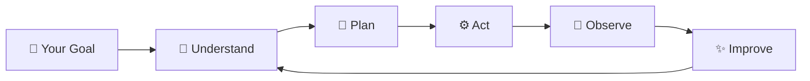
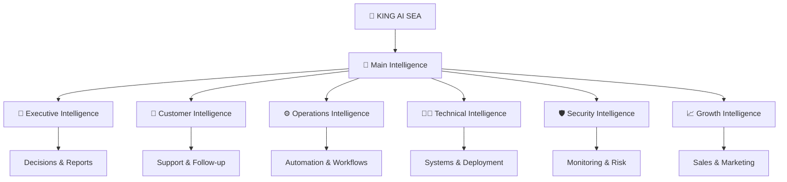
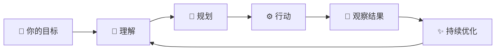
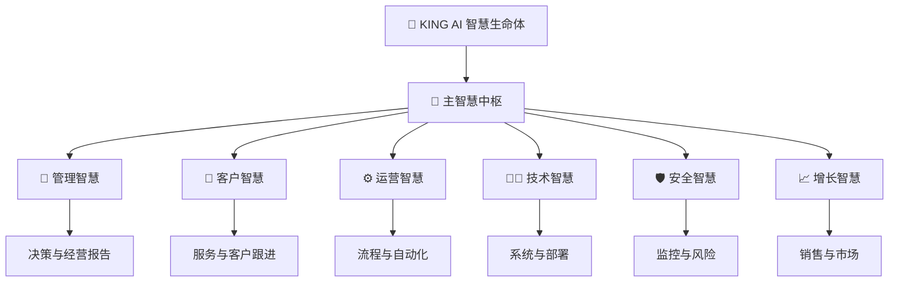

<div align="center">

# 👑 KING AI · SEA
## **The Intelligent Lifeform for People & Enterprises**
### **Think · Remember · Act · Evolve**

**Not another chatbot. Not another automation tool.**  
**A digital intelligent lifeform designed to understand goals, stay with you, work with you, and grow with you.**

🌐 **Official Website:** https://www.kingai.work  
✉️ **Business & Partnership:** vip@kingai.work


---

### ✦ One AI. A Living Digital Intelligence.

> **Give ordinary AI a question. Give KING AI a goal.**

</div>

---

# ✦ ENGLISH

## 01 · What is KING AI SEA?

**KING AI SEA** is a next-generation intelligent lifeform system created for both **individuals and enterprises**.

It is designed to go beyond conversation. It can understand objectives, retain useful context, coordinate work, connect with approved tools and systems, assist with real-world execution, and continuously adapt to the way its owner works.

KING AI SEA is built around a simple promise:

### **AI should not only answer. AI should understand, assist, execute, and evolve.**

It can become your:

🧠 **Second Brain** · 🤝 **AI Partner** · 🛰️ **Digital Operator** · 🧩 **AI Workforce** · 🛡️ **Intelligent Guardian** · ⚙️ **Automation Center** · 📊 **Decision Assistant** · 🌐 **Digital Presence**

---

## 02 · A Different Kind of AI Experience

Most AI products wait for instructions.

KING AI SEA is designed for a deeper relationship between human intent and digital intelligence.

Instead of repeatedly explaining the same context, users can build an intelligent digital companion that becomes increasingly familiar with their goals, working style, priorities, projects, preferences, and operating environment.

### The experience is designed to feel less like “using software” and more like **working with a digital intelligence that knows how you operate.**



> The diagram is intentionally high-level. Proprietary implementation details are not disclosed in this public project.

---

## 03 · Designed for Individuals

### **Your Personal Second Brain**

Imagine an AI that can stay connected to the important parts of your digital life and help you move from intention to completion.

KING AI SEA can be positioned as a personal intelligence layer that helps with:

- 🧠 Long-term personal knowledge and context
- 📅 Daily planning, reminders, priorities and follow-up
- ✉️ Email understanding, drafting and communication support
- 📚 Research, learning and information synthesis
- 🗂️ Document, note and knowledge organization
- 🧑‍💻 Technical assistance and digital operations
- 🌍 Travel, planning and decision support
- 💼 Personal projects and business operations
- 📈 Goal tracking and progress review
- ✍️ Creative work, writing, content and ideas
- 🛰️ Cross-device and cross-service assistance through approved integrations
- 🔔 Proactive notifications for important changes and events

### You stop managing dozens of tools separately.
### You start working through one intelligent digital presence.

---

## 04 · Designed for Enterprises

### **Build an AI Workforce Around Your Business**

For organizations, KING AI SEA can become a unified intelligence layer across departments, workflows, systems and teams.

Instead of deploying isolated AI tools, an enterprise can build a coordinated digital workforce around real business goals.

| Business Area | What KING AI Can Help With |
|---|---|
| 👔 Executive | Summaries, priorities, decision support, risk visibility |
| 💬 Customer Service | 24/7 assistance, triage, follow-up, knowledge access |
| 📈 Sales | Lead handling, follow-up, CRM assistance, opportunity tracking |
| 📣 Marketing | Content, SEO, campaigns, research, publishing workflows |
| 🧑‍💻 IT Operations | System checks, deployment assistance, diagnostics, reporting |
| 🛡️ Security | Monitoring, anomaly awareness, incident support, audit assistance |
| 💳 Finance | Reporting, invoicing support, reconciliation workflows, analysis |
| 🧑‍🤝‍🧑 HR | Internal knowledge, onboarding, policy access, workflow assistance |
| ⚙️ Operations | SOP execution, task routing, automation, status reporting |
| 📊 Management | Unified visibility, alerts, summaries and business intelligence |

### One company can operate with both:

**Human Team + AI Team**

---

## 05 · Not One Agent — An Intelligent Digital Organization

KING AI SEA can coordinate multiple specialized AI roles while presenting users with one unified intelligent experience.



Each role can be shaped around the organization’s responsibilities, permissions and approved tools.

---

## 06 · Core Capability Experience

### 🧠 Understand
KING AI is designed to interpret goals, context, priorities and intent instead of responding only to isolated prompts.

### 🧬 Remember
It can maintain useful long-term context so users do not need to rebuild the relationship from zero every time.

### ⚙️ Act
With user-approved access, it can assist with actions across connected systems, workflows, services and digital environments.

### 🧭 Coordinate
It can help organize complex objectives into manageable steps and coordinate multiple specialized capabilities.

### 📡 Observe
It can watch approved signals, status changes, systems and workflows to help surface what deserves attention.

### ✨ Evolve
KING AI SEA is designed to become increasingly aligned with the way its owner or organization works over time.

### 🛡️ Stay Controlled
Automation scope, execution permissions and security boundaries are defined by the user or organization.

---

## 07 · From “Answer” to “Outcome”

Traditional AI:

```text
You ask → AI answers → You do the work
```

KING AI SEA experience:

```text
You define the goal → KING AI understands → coordinates → assists with execution → reports the outcome
```

The value is not just better answers.

### The value is reducing the distance between **what you want** and **what gets done**.

---

## 08 · Enterprise Private Intelligence

Organizations can position KING AI SEA as their own private intelligence environment.

Potential deployment models include:

- ☁️ Cloud deployment
- 🖥️ Private VPS
- 🏢 Enterprise private infrastructure
- 🔐 Controlled internal environment
- 🧠 Hybrid cloud + local intelligence
- 🌐 Multi-system business integration

The public project intentionally does not disclose proprietary system architecture, internal orchestration, memory implementation, security internals, private prompts, model-routing logic, self-evolution logic, or privileged control mechanisms.

---

## 09 · A Lifeform That Can Grow With You

A normal application is installed and used.

KING AI SEA is envisioned differently.

The longer it serves a person or organization, the more valuable the relationship can become through accumulated context, approved knowledge, workflows, preferences and operational understanding.

### Day 1: It learns how you work.
### Day 30: It understands recurring patterns.
### Day 100: It becomes part of your operating rhythm.

This is the direction of **persistent digital intelligence**.

---

## 10 · High-Value Use Cases

### 👤 Personal
- Personal second brain
- Executive-style personal assistant
- Knowledge and research companion
- Project management partner
- Digital life organization
- Personal website and digital identity assistant
- Technical operations assistant
- Long-term goal companion

### 🏢 Business
- AI customer-service workforce
- AI sales operations
- AI marketing operations
- AI business intelligence
- AI executive assistant layer
- AI IT operations
- AI workflow automation
- AI internal knowledge center
- AI operations control room

### 🧑‍💻 Builders & Developers
- Intelligent agent applications
- Business workflow orchestration
- Custom AI operators
- AI-enabled SaaS products
- Private AI systems
- Vertical-industry AI solutions

---

## 11 · The Brand Promise

<div align="center">

### **AI That Lives, Learns and Evolves.**

### **Think · Remember · Act · Evolve**

**One intelligence for your digital world.**

🌐 https://www.kingai.work  
✉️ vip@kingai.work

</div>

---

# ✦ 中文

## 01 · 什么是 KING AI 智慧生命体 SEA？

**KING AI 智慧生命体 SEA** 是面向 **个人与企业** 的下一代数字智慧生命体系统。

它的目标不是再做一个聊天机器人，也不是再做一个只能回答问题的 AI 工具。

KING AI 希望让 AI 真正进入用户的数字世界：理解目标、保留重要上下文、协同工作、连接经过授权的系统与工具、辅助真实任务执行，并随着长期使用越来越懂自己的主人或企业。

### **AI 不应该只会回答。AI 应该能够理解、协助、行动，并持续成长。**

它可以成为你的：

🧠 **第二大脑** · 🤝 **AI伙伴** · 🛰️ **数字执行者** · 🧩 **AI员工团队** · 🛡️ **智慧守护者** · ⚙️ **自动化中心** · 📊 **决策助手** · 🌐 **数字分身**

---

## 02 · 一种完全不同的 AI 体验

普通 AI 等你提问。

KING AI SEA 更强调“长期陪伴 + 持续理解 + 实际协作”。

你不需要每一次都重新解释自己是谁、公司在做什么、项目进行到哪里、什么事情最重要。

它可以逐步了解你的目标、工作方式、项目、习惯、偏好和业务环境。

### 最终体验不再像“打开一个软件”，而更像是在和一个真正懂你工作方式的数字智慧体共同工作。



> 本项目仅展示对外能力与产品体验。核心实现、内部机制与专有技术不会在公开仓库中披露。

---

## 03 · 面向个人：你的第二大脑

想象一下，你拥有一个长期在线的数字智慧体。

它知道你正在做什么，也知道哪些事情对你重要；它可以帮助你从“想到”走到“完成”。

KING AI 可以帮助个人处理：

- 🧠 长期知识与个人上下文
- 📅 日程、提醒、优先级、待办与跟进
- ✉️ 邮件理解、回复与沟通辅助
- 📚 搜索、研究、学习和信息整理
- 🗂️ 文档、笔记与知识管理
- 🧑‍💻 技术支持与数字系统操作辅助
- 🌍 出行、计划和决策支持
- 💼 个人项目、创业和业务管理
- 📈 长期目标与进度回顾
- ✍️ 内容、创作、写作和灵感
- 🛰️ 经授权的跨设备、跨服务协作
- 🔔 对重要变化进行主动提醒

### 未来，你不需要分别管理十几个工具。
### 你只需要告诉 KING AI：**“这是我要达到的目标。”**

---

## 04 · 面向企业：建立属于自己的 AI Workforce

企业真正需要的不是更多聊天窗口，而是能够进入业务流程的 **AI 数字劳动力**。

KING AI SEA 可以帮助企业把多个部门、流程、知识和系统连接到一个统一的智慧层中。

| 企业场景 | KING AI 可提供的价值 |
|---|---|
| 👔 管理层 | 经营摘要、决策辅助、重点事项、风险提示 |
| 💬 客户服务 | 7×24 服务、分流、跟进、知识调用 |
| 📈 销售 | 线索、跟进、CRM协助、机会管理 |
| 📣 市场 | 内容、SEO、活动、研究、发布流程 |
| 🧑‍💻 IT | 系统检查、部署辅助、诊断、报告 |
| 🛡️ 安全 | 监控、异常提醒、事件辅助、审计支持 |
| 💳 财务 | 报表、发票、对账流程、数据分析 |
| 🧑‍🤝‍🧑 HR | 员工知识、入职、制度、流程辅助 |
| ⚙️ 运营 | SOP、自动化、任务分配、状态报告 |
| 📊 管理 | 统一视图、预警、摘要和经营智能 |

最终企业形成：

## **Human Team + AI Team**

人类负责方向、创造力、关系与最终决策。

AI 负责信息、重复劳动、执行辅助、监控、整理和持续协作。

---

## 05 · 不只是一个 Agent，而是一支数字智慧团队

KING AI SEA 可以围绕企业不同岗位组织出多个专业 AI 角色，同时对用户保持一个统一的智慧入口。



每个智慧角色都可以围绕企业自己的职责、权限和工具进行配置。

---

## 06 · 用户真正感受到的七大能力

### 🧠 懂你
不是只理解一句话，而是尽量理解你的目标、背景、优先级和真实意图。

### 🧬 记得你
重要信息可以形成长期上下文，让下一次协作不需要从零开始。

### ⚙️ 帮你做
在用户授权范围内，连接不同系统、工具和流程，协助真实任务执行。

### 🧭 帮你管
把复杂目标整理成任务、节点和行动路径，减少混乱和遗漏。

### 📡 帮你看
持续关注经过授权的状态、变化和重要事件，把真正需要注意的事情推到你面前。

### ✨ 越来越懂你
随着长期使用，逐渐适应个人或企业的工作方式。

### 🛡️ 你永远拥有控制权
KING AI 的自动化范围、执行权限与安全边界由使用者设定。

---

## 07 · 从“答案”走向“结果”

传统 AI：

```text
你提问 → AI回答 → 你自己继续完成所有工作
```

KING AI SEA：

```text
你给出目标 → KING AI理解 → 协调任务 → 协助执行 → 汇报结果
```

真正的价值不是多回答几个问题。

而是：

### **缩短“我想要”与“事情真正完成”之间的距离。**

---

## 08 · 企业级私有智慧环境

企业可以把 KING AI SEA 建设成属于自己的私有智慧环境。

可面向：

- ☁️ 云端部署
- 🖥️ 私有 VPS
- 🏢 企业私有基础设施
- 🔐 内部受控环境
- 🧠 云端 + 本地混合智能
- 🌐 多业务系统协同

公开项目不会披露：内部调度机制、记忆实现、专有安全机制、私有提示体系、模型选择逻辑、自进化实现、核心权限控制等专有技术。

---

## 09 · 会随着你一起成长的数字智慧体

普通软件安装以后，功能基本固定。

KING AI SEA 的产品方向不同。

随着长期使用，它可以逐步积累经授权的知识、项目上下文、工作流程、用户偏好和运营理解。

### 第 1 天：它开始了解你。
### 第 30 天：它开始熟悉你的规律。
### 第 100 天：它开始成为你工作方式的一部分。

这就是 **持续存在的数字智慧**。

---

## 10 · 高价值应用场景

### 👤 个人
- 个人第二大脑
- 私人高阶助理
- 知识与研究伙伴
- 项目管理伙伴
- 数字生活管理
- 个人数字身份助手
- 技术与系统助手
- 长期目标伙伴

### 🏢 企业
- AI 客服团队
- AI 销售运营
- AI 市场运营
- AI 商业智能
- AI 高管助理层
- AI IT 运维
- AI 工作流自动化
- AI 企业知识中心
- AI 运营控制中心

### 🧑‍💻 开发者与创业者
- 智慧 Agent 应用
- 企业流程编排
- 定制 AI 执行者
- AI SaaS 产品
- 私有 AI 系统
- 垂直行业 AI 解决方案

---

## 11 · KING AI 的品牌承诺

<div align="center">

# **会思考，会行动，会成长。**

### **Think · Remember · Act · Evolve**

### **一个智慧生命体，连接你的整个数字世界。**

🌐 https://www.kingai.work  
✉️ vip@kingai.work

</div>

---

## ✦ Public Project Notice / 公开项目说明

This repository is a **public-facing product and brand presentation** for KING AI SEA. It intentionally focuses on capabilities, user value, deployment scenarios and business vision.

Proprietary implementation details are intentionally excluded.

本仓库为 **KING AI 智慧生命体 SEA 的对外品牌与产品展示项目**，重点介绍能力、用户价值、应用场景与商业愿景。

核心实现与专有技术不在公开项目中披露。

---

<div align="center">

**👑 KING AI · SEA**  
**The Intelligent Lifeform for People & Enterprises**

🌐 **www.kingai.work** · ✉️ **vip@kingai.work**

</div>
