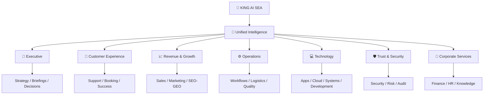

<div align="center">


# 👑 KING AI · SEA
## **The Intelligent Lifeform for People & Enterprises**
### **Think · Remember · Act · Evolve**

**Not another chatbot. Not another isolated AI tool.**  
**A persistent digital intelligence designed to understand goals, coordinate AI employees, connect approved systems, help execute real work, and become more useful over time.**

🌐 **Official Website:** https://www.kingai.work  
✉️ **Business & Partnership:** vip@kingai.work


> **Give ordinary AI a question. Give KING AI a goal.**

</div>

---

# ✦ ENGLISH

## 01 · What is KING AI SEA?

**KING AI SEA** is a unified intelligent-lifeform system for **individuals, enterprises, developers, AI employees, intelligent websites, intelligent applications and agentic automation**.

It is designed to move beyond one-off AI conversations and become a persistent intelligence layer across real digital work.

KING AI SEA can be positioned as:

🧠 **Personal Second Brain** · 🏢 **Enterprise Intelligent Lifeform** · 🤖 **AI Workforce** · 🌐 **Intelligent Website** · 📱 **Intelligent App Layer** · ⚙️ **Agentic Automation Platform** · 🧑‍💻 **Developer Agent Platform** · 🛡️ **Governed Digital Intelligence**

### The public product promise

**Understand the goal. Preserve useful context. Coordinate work. Act within permission. Observe results. Improve over time.**

---

## 02 · One Unified System, Many Intelligent Forms

KING AI SEA remains one system while adapting to different environments.

### 👤 Personal Intelligence
A persistent second brain for planning, knowledge, projects, communication, research, creativity, technical work and digital-life operations.

### 🏢 Enterprise Intelligence
A business-wide intelligence layer connecting people, AI employees, knowledge, workflows, applications and operating signals.

### 🤖 AI Employees
Specialized digital roles for customer service, sales, marketing, operations, finance, HR, IT, security, management and industry-specific work.

### 🌐 Intelligent Websites
A 24/7 digital front door for conversation, search, lead qualification, customer service, booking, sales assistance, knowledge and conversion.

### 📱 Intelligent Applications
An intelligence layer embedded into web apps, mobile apps, SaaS and internal enterprise software so users can operate systems through natural language and agentic workflows.

### 🧑‍💻 Developer Platform
A future builder ecosystem for agents, workflows, skills, integrations, APIs, embedded experiences and industry applications.

### 🏭 Industry Intelligence
Specialized intelligent-lifeform experiences for hospitality, logistics, property operations, senior-care administration, healthcare administration, professional services, commerce, real estate, education, SaaS and more.

---

## 03 · From Answer to Outcome

Traditional AI often follows:

```text
Prompt → Answer → User does the work
```

KING AI SEA is designed around:

```text
Goal → Understand → Plan → Coordinate → Act → Observe → Report → Improve
```

The value is not simply generating a better answer.

### The value is reducing the distance between **what the user wants** and **what actually gets completed**.

---

## 04 · AI Workforce

For organizations, KING AI SEA can form a coordinated digital workforce.



A company can evolve from one useful agent into a broader operating model:

**Single Agent → AI Employee → Department AI → Multi-Agent Workflow → AI Workforce → Enterprise Intelligent Lifeform**

---

## 05 · AI Employees

Public AI employee categories include:

- 👔 AI Chief of Staff
- 💬 AI Receptionist
- 🎧 Customer Service Agent
- 📈 Sales Development Agent
- 🤝 Customer Success Agent
- 📣 Marketing Agent
- 🔎 SEO/GEO Agent
- ✍️ Content Agent
- ⚙️ Operations Coordinator
- 🚚 Logistics Operations Agent
- 📦 Inventory & Procurement Agent
- 🧑‍💻 Developer Agent
- ☁️ Cloud / DevOps Agent
- 🖥️ System Operations Agent
- 🌐 Website Operations Agent
- 🛡️ Security Operations Agent
- 📋 Audit Assistant
- 💳 Finance Operations Agent
- 🧾 Invoice Agent
- 🧑‍🤝‍🧑 HR Service Agent
- 🎯 Recruiting Agent
- 🏭 Industry-specific AI employees

Each role can be shaped around responsibilities, approved knowledge, tools, permissions, workflows and human escalation rules.

---

## 06 · Personal Second Brain

For individuals, KING AI SEA can support:

- long-term personal context
- planning and priorities
- reminders and follow-up
- email and communication
- research and learning
- notes, files and documents
- personal projects
- entrepreneurship
- content and creativity
- technical assistance
- travel and decision support
- recurring reviews
- proactive notifications
- approved cross-service digital operations

### The goal is one persistent digital intelligence that becomes part of the user’s operating rhythm.

---

## 07 · Intelligent Website

A KING AI-enabled website can move beyond static navigation.

It can support:

- conversational site navigation
- intelligent search
- product/service discovery
- lead capture and qualification
- AI receptionist
- customer service
- booking and reservations
- quote requests
- multilingual service
- recommendation assistance
- human escalation
- follow-up workflows

Within approved integrations, a website conversation can become a structured business action such as a CRM lead, support ticket, booking request, sales task or service case.

---

## 08 · Intelligent Applications & SaaS

KING AI SEA can be embedded into web apps, mobile apps, SaaS and internal software.

Users can ask for outcomes instead of learning every menu:

> “Show me what needs attention today.”  
> “Prepare the weekly report.”  
> “Find customers at risk and prepare follow-ups.”  
> “Explain why this metric changed.”  
> “Create a task from this conversation.”

Product teams can build embedded copilots, domain agents, natural-language analytics, workflow generation, AI onboarding, support agents and action-taking assistants.

---

## 09 · Agentic Automation & Long-Running Work

KING AI SEA can support different work patterns:

- one-time tasks
- recurring tasks
- scheduled workflows
- event-driven workflows
- condition-based monitoring
- long-running tasks
- approval-driven processes
- multi-agent workflows
- human-in-the-loop execution

A sophisticated workflow may include triggers, context gathering, planning, tool use, specialized AI roles, branches, waits, retries, checkpoints, approvals, escalation and reporting.

---

## 10 · Memory, Continuity & Evolution

KING AI SEA is designed so useful long-term work does not need to restart from zero every session.

Public experience concepts include:

- durable useful context
- project continuity
- organizational memory
- recurring workflow history
- user preferences
- approved knowledge
- outcome awareness
- continuous improvement

Within the unified KING AI SEA system:

- **Evolution OS** is the operating architecture.
- **SAE** is the controlled self-evolution mechanism.
- **ACRE** represents the active defense / immune-system security concept.
- **Root Policy Kernel** represents high-authority policy and execution boundaries.

These are components and mechanisms inside KING AI SEA, not separate competing products.

Their proprietary internal implementation is not disclosed in this public repository.

---

## 11 · Voice, Vision & Multimodal Intelligence

KING AI SEA can extend beyond text through experiences such as:

- real-time voice interaction
- AI phone receptionist
- voice customer service
- multilingual voice
- image understanding
- screenshot analysis
- document understanding
- photo/document intake
- screen-aware assistance
- multimodal workflows

The objective is to let intelligence interact in the mode most natural to the situation.

---

## 12 · Enterprise Knowledge & Data Intelligence

KING AI SEA can become an intelligent interface for approved organizational knowledge and business data.

Potential sources include:

- policies and SOPs
- product documentation
- project history
- customer knowledge
- technical documentation
- finance/HR/admin documents
- databases and business systems
- approved external sources

Potential experiences include enterprise search, source-aware summaries, historical context, KPI summaries, anomaly explanations, management reporting and knowledge-to-action workflows.

---

## 13 · AI Control Center

A serious AI workforce needs a control plane.

The KING AI SEA Control Center concept can include:

- 🧑‍✈️ Executive Overview
- 🤖 Agent Registry
- 🎯 Mission & Task Center
- ✅ Approval Center
- ⚙️ Workflow Center
- 📚 Knowledge Center
- 🔌 Integration Center
- 🛡️ Governance Center
- 🛰️ Observability Center
- 🧪 Evaluation Center
- 💰 Cost & Resource Center
- 🚀 Deployment Center

### More intelligence should not require less control.

---

## 14 · Governance, Security & Human Authority

KING AI SEA is designed around operator-defined control.

Public governance principles include:

- explicit ownership
- scoped permissions
- least-necessary access
- sensitive-action approvals
- human-in-the-loop
- role separation
- auditability
- environment boundaries
- credential protection
- human escalation
- measurable quality
- recovery and fallback planning

### **Automation scope, execution permissions and security boundaries are defined by the user or organization.**

---

## 15 · Observability & Evaluation

Enterprise-grade AI should be measurable.

Potential visibility includes:

- agent activity
- workflow status
- tool activity
- success/failure rates
- latency
- retries
- approvals
- escalations
- usage
- cost
- quality metrics
- regression testing
- business outcome metrics

The objective is **observable, controllable and continuously improvable intelligence**.

---

## 16 · Interoperability

KING AI SEA is designed for a multi-vendor world.

Public product direction includes compatibility with modern approaches for:

- APIs and webhooks
- tool/function calling
- MCP-style tool and context connectivity
- agent-to-agent interoperability
- enterprise connectors
- event-driven workflows
- model-provider flexibility
- application embedding

Proprietary model-routing and orchestration logic remains private.

---

## 17 · Developer Ecosystem

Developers can build around the public KING AI SEA platform direction through concepts such as:

- Agent Builder
- Workflow Builder
- Skills
- Tools
- APIs / SDKs
- Knowledge connections
- event triggers
- approval workflows
- app embedding
- observability hooks
- evaluation interfaces
- deployment templates
- agent interoperability

The long-term ecosystem can support third-party solutions without exposing the proprietary core.

---

## 18 · Agent & Skill Marketplace

A future ecosystem can distribute approved:

- AI employees
- industry agents
- skills
- workflow packs
- integrations
- knowledge packs
- website agents
- app components
- automation templates

Extensions should be versioned, permission-aware, reviewed and transparent about required access.

---

## 19 · Agent Commerce

KING AI SEA can support governed commercial workflows such as:

- product/service discovery
- recommendations
- quotes
- bookings
- reservations
- procurement
- invoices
- subscriptions
- renewals
- order coordination

Financial actions require appropriate authorization and compliant external payment infrastructure.

---

## 20 · Industry Solutions

Public industry directions include:

🏨 Hospitality · 🚚 Logistics · 🏢 Property Management · 👵 Senior-Care Administration · 🏥 Healthcare Administration · 💼 Professional Services · ⚖️ Legal Operations Support · 🏠 Real Estate · 🛍️ Retail & E-Commerce · 🍽️ Restaurants · 🎓 Education · 💻 SaaS · 🏭 Manufacturing · 🧰 Field Service · ✈️ Travel · 🎬 Media

A real vertical solution should use industry-specific workflows, terminology, permissions and measurable outcomes — not simple keyword replacement.

---

## 21 · Deployment Spectrum

KING AI SEA can support deployment directions such as:

- cloud
- dedicated VPS
- private cloud
- enterprise-controlled infrastructure
- hybrid cloud/private environments
- isolated business environments
- multi-region deployments
- local/edge intelligence where appropriate

Deployment depends on privacy, governance, latency, integrations and business requirements.

---

## 22 · Product Editions

All editions remain part of the same KING AI SEA system:

| Edition | Primary Use |
|---|---|
| 👤 Personal | Second brain and personal digital intelligence |
| 💼 Professional | Founders, creators, consultants, independent operators |
| 🏢 Business | AI employees and team automation |
| 🏛️ Enterprise | AI workforce, private deployment, governance and deep integrations |
| 🧑‍💻 Developer | Agentic apps, tools, workflows and integrations |
| 🏭 Industry | Deep vertical intelligent-lifeform solutions |
| 🌐 Website Intelligence | AI-powered public digital front door |
| 📱 Application Intelligence | Embedded intelligence for apps and SaaS |

---

## 23 · Documentation

### Flagship
- [Complete Platform Blueprint](docs/ULTIMATE-PLATFORM.md)
- [Public Architecture](docs/PUBLIC-ARCHITECTURE.md)
- [Documentation Hub](docs/INDEX.md)
- [Why KING AI SEA?](docs/WHY-KING-AI.md)

### People & Business
- [Personal Intelligence](docs/PERSONAL.md)
- [Enterprise Intelligence](docs/ENTERPRISE.md)
- [AI Employees](docs/AI-EMPLOYEES.md)
- [AI Control Center](docs/AI-CONTROL-CENTER.md)
- [Product Editions](docs/PRODUCT-EDITIONS.md)

### Experience & Operations
- [Intelligent Websites & Applications](docs/WEBSITE-APP-INTELLIGENCE.md)
- [Agentic Automation & Workflows](docs/AUTOMATION-WORKFLOWS.md)
- [Memory, Continuity & Evolution](docs/MEMORY-EVOLUTION.md)
- [Voice, Vision & Multimodal](docs/VOICE-MULTIMODAL.md)
- [Knowledge & Data](docs/KNOWLEDGE-DATA.md)

### Enterprise Readiness
- [Deployment](docs/DEPLOYMENT.md)
- [Interoperability](docs/INTEROPERABILITY.md)
- [Governance, Observability & Evaluation](docs/GOVERNANCE-OBSERVABILITY.md)
- [Security](docs/SECURITY.md)

### Ecosystem & Market
- [Developer Ecosystem](docs/DEVELOPER-ECOSYSTEM.md)
- [Marketplace](docs/MARKETPLACE.md)
- [Agent Commerce](docs/AGENT-COMMERCE.md)
- [Industry Solutions](docs/INDUSTRY-SOLUTIONS.md)
- [Global Go-To-Market](docs/GLOBAL-GO-TO-MARKET.md)
- [Flagship Roadmap](docs/FLAGSHIP-ROADMAP.md)
- [FAQ](docs/FAQ.md)

### Search & AI Discovery
- [Global SEO + GEO Strategy](seo/SEO-GEO-STRATEGY.md)
- [Canonical Entity & Knowledge Graph](seo/ENTITY-KNOWLEDGE.md)
- [Structured Data Template](seo/king-ai-sea-structured-data.jsonld)
- [Machine-Readable Canonical Facts](llms.txt)

---

## 24 · Public Technology Boundary

This repository does **not** publish KING AI SEA proprietary internals including private orchestration logic, proprietary memory implementation, self-evolution algorithms, internal security architecture, privileged control mechanisms, private prompts, production credentials, proprietary model-routing logic, unpublished infrastructure topology, internal policy-engine implementation or trade-secret workflows.

The repository exists to explain **what KING AI SEA is, what it can become, who it serves, how it can be deployed, how it stays governed, and how its ecosystem can grow.**

---

<div align="center">

## **AI That Lives, Learns and Evolves.**
### **Think · Remember · Act · Evolve**

🌐 **https://www.kingai.work**  
✉️ **vip@kingai.work**

</div>

---

# ✦ 中文

## 01 · 什么是 KING AI SEA？

**KING AI SEA** 是一个面向 **个人、企业、开发者、AI 员工、智慧网站、智慧 APP 和 Agentic 自动化** 的统一智慧生命体系统。

它不只是聊天机器人，也不是一个孤立 AI 工具，而是希望成为长期存在于真实数字工作中的智慧层。

KING AI SEA 可以成为：

🧠 **个人第二大脑** · 🏢 **企业智慧生命体** · 🤖 **AI Workforce** · 🌐 **智慧网站** · 📱 **APP 智慧层** · ⚙️ **Agentic 自动化平台** · 🧑‍💻 **开发者智能体平台** · 🛡️ **受治理数字智慧**

### 核心公开承诺

**理解目标 · 保留有效上下文 · 协调工作 · 在权限范围内行动 · 观察结果 · 持续优化**

---

## 02 · 一个统一系统，多种智慧形态

KING AI SEA 始终是一套统一系统，只是在不同环境中呈现不同智慧形态。

### 👤 个人智慧
成为长期第二大脑，帮助处理计划、知识、项目、沟通、研究、创作、技术工作和数字生活运营。

### 🏢 企业智慧
成为连接企业人员、AI 员工、知识、工作流、应用和运营信号的统一智慧层。

### 🤖 AI 员工
围绕客服、销售、市场、运营、财务、HR、IT、安全、管理和行业岗位形成专业数字员工。

### 🌐 智慧网站
把企业官网升级为 7×24 小时在线的智慧入口，承担对话、搜索、获客、客服、预约、销售辅助、知识与转化。

### 📱 智慧 APP
进入 Web App、手机 App、SaaS 和企业内部软件，让用户通过自然语言和 Agentic Workflow 操作系统。

### 🧑‍💻 开发者平台
未来围绕 Agent、Workflow、Skill、Integration、API、应用内嵌和行业方案形成 Builder 生态。

### 🏭 行业智慧
针对酒店、物流、物业、养老管理、医疗行政、专业服务、电商、房地产、教育、SaaS 等行业形成专业智慧生命体。

---

## 03 · 从回答走向结果

传统 AI 往往是：

```text
用户提问 → AI 回答 → 用户自己完成后续工作
```

KING AI SEA 的方向是：

```text
目标 → 理解 → 规划 → 协调 → 行动 → 观察 → 汇报 → 优化
```

真正的价值不是“回答得更漂亮”，而是：

### 减少 **用户想完成什么** 与 **事情真正被完成** 之间的距离。

---

## 04 · AI Workforce

企业可以围绕 KING AI SEA 建立完整 AI 数字员工体系：

**管理层 → 客户体验 → 收入增长 → 企业运营 → 技术 → 安全 → 财务/HR/知识**。

企业升级路径可以是：

**一个 Agent → 一个 AI 员工 → 一个部门 AI → 多 Agent 工作流 → AI Workforce → 企业智慧生命体**

---

## 05 · AI 员工

公开 AI 员工类别包括：

- AI Chief of Staff
- AI 前台
- AI 客服
- AI 销售开发
- 客户成功 Agent
- 市场 Agent
- SEO/GEO Agent
- 内容 Agent
- 运营协调 Agent
- 物流运营 Agent
- 库存/采购 Agent
- Developer Agent
- DevOps / Cloud Agent
- System Operations Agent
- Website Operations Agent
- Security Operations Agent
- Audit Assistant
- Finance Operations Agent
- Invoice Agent
- HR Service Agent
- Recruiting Agent
- 行业定制 AI 员工

每个角色都可以围绕职责、授权知识、工具、权限、工作流和人工升级规则进行配置。

---

## 06 · 个人第二大脑

KING AI SEA 可以帮助个人处理：长期上下文、计划、提醒、邮件、研究、学习、文件、项目、创业、创作、技术、出行、决策、周期复盘、主动提醒以及经授权的跨服务数字操作。

### 最终目标，是成为真正进入个人长期工作节奏的数字智慧。

---

## 07 · 智慧网站

KING AI 网站不只展示内容，还可以理解访客意图。

它可以提供：

- 对话导航
- 智慧搜索
- 产品/服务发现
- 获客
- 线索资格判断
- AI 前台
- AI 客服
- 预约/预订
- 询价
- 多语言
- 推荐
- 人工升级
- 后续跟进

在经过授权的系统连接下，一次网站对话可以继续变成 CRM 线索、客服工单、预约请求、销售任务或服务案件。

---

## 08 · 智慧 APP 与 SaaS

KING AI SEA 可以进入 Web App、手机 App、SaaS 和企业软件。

用户不必学习每个菜单，而可以直接说：

> “告诉我今天最需要处理什么。”  
> “生成本周报告。”  
> “找出可能流失的客户并准备跟进。”  
> “解释这个指标为什么变化。”

产品可以加入 AI Copilot、行业 Agent、自然语言分析、Workflow Generation、AI onboarding、客服和可以执行动作的助手。

---

## 09 · Agentic 自动化与长任务

KING AI SEA 可以支持：

- 一次性任务
- 周期任务
- 定时任务
- 事件驱动
- 条件监控
- 长时间任务
- 审批驱动工作流
- 多智能体工作流
- Human-in-the-loop

高级 Workflow 可以包含 Trigger、上下文、规划、Tool、专业 Agent、分支、等待、重试、Checkpoint、审批、人工升级和报告。

---

## 10 · 记忆、连续性与进化

KING AI SEA 的长期工作不应该每次从零开始。

公开体验包括：长期有效上下文、项目连续性、组织记忆、工作流历史、用户偏好、授权知识、结果感知和持续优化。

统一 KING AI SEA 系统内部：

- **Evolution OS** 是操作架构。
- **SAE** 是受控自我进化机制。
- **ACRE** 是主动防御/免疫系统安全概念。
- **Root Policy Kernel** 是高权限策略与执行边界概念。

它们都是 KING AI SEA 内部组成部分，不是互相分离的产品。

核心专有实现不在公开仓库披露。

---

## 11 · 语音、视觉和多模态

KING AI SEA 可以扩展到：实时语音、AI 电话前台、语音客服、多语言语音、图片理解、截图分析、文档理解、照片/文件录入、屏幕辅助和多模态工作流。

目标是让智慧以最自然的方式出现在当前场景里，而不是强迫所有事情都通过聊天框完成。

---

## 12 · 企业知识与数据智慧

KING AI SEA 可以连接经过授权的企业制度、SOP、产品资料、项目历史、客户知识、技术文档、财务/HR/行政资料、数据库和企业系统。

员工可以通过自然语言进行企业搜索、获取带来源意识的摘要、理解历史上下文、查看 KPI 摘要、异常解释、管理报表，并进一步把知识转化成经过授权的行动。

---

## 13 · AI Control Center

真正的 AI Workforce 必须拥有统一控制平面。

KING AI SEA Control Center 可以包括：

- 管理层总览
- Agent Registry
- Mission & Task Center
- Approval Center
- Workflow Center
- Knowledge Center
- Integration Center
- Governance Center
- Observability Center
- Evaluation Center
- Cost & Resource Center
- Deployment Center

### 获得更强智慧，不应该以失去控制为代价。

---

## 14 · 治理、安全与人类最终权力

KING AI SEA 的公开治理原则包括：明确所有者、权限范围、最小必要访问、敏感动作审批、Human-in-the-loop、职责分离、审计、环境边界、凭据保护、人工升级、质量衡量和恢复计划。

### **自动化范围、执行权限与安全边界由使用者或企业设定。**

---

## 15 · 可观测与评估

企业级 AI 必须可衡量。

可以观察：Agent 活动、Workflow 状态、Tool 使用、成功率、失败率、延迟、重试、审批、人工升级、用量、成本、质量指标、回归测试和商业结果。

目标是：

### **可观察、可控制、可持续优化的智慧。**

---

## 16 · 智能体互联

KING AI SEA 面向多厂商、多模型、多工具、多 Agent 的世界。

公开产品方向包括：API、Webhook、Tool/Function Calling、MCP 类连接、Agent-to-Agent 互操作、企业连接器、事件驱动、多模型适配和应用内嵌。

具体模型路由和内部调度逻辑不公开。

---

## 17 · 开发者生态

未来开发者可以围绕 KING AI SEA 构建：

- Agent Builder
- Workflow Builder
- Skills
- Tools
- API / SDK
- Knowledge Connections
- Event Triggers
- Approval Workflows
- App Embedding
- Observability Hooks
- Evaluation Interfaces
- Deployment Templates
- Agent Interoperability

开发者可以扩展生态，而不需要接触 KING AI 的核心专有技术。

---

## 18 · Agent / Skill Marketplace

未来可以分发经过审核的：AI 员工、行业 Agent、Skills、Workflow Packs、Integrations、Knowledge Packs、网站 Agent、APP 组件和自动化模板。

每个扩展都应该具备清晰版本、权限、审核和访问说明。

---

## 19 · Agent Commerce

KING AI SEA 可以支持受治理的产品发现、推荐、报价、预约、预订、采购、发票、订阅、续费和订单协调流程。

涉及资金的操作需要适当授权和合规的外部支付基础设施。

---

## 20 · 行业方案

公开行业方向包括：酒店、物流、物业、养老管理、医疗行政、专业服务、法律运营辅助、房地产、零售电商、餐饮、教育、SaaS、制造、现场服务、旅游和媒体等。

真正的行业方案必须使用行业专属工作流、术语、权限和可衡量业务结果，而不是简单替换关键词。

---

## 21 · 全部署形态

可以覆盖云端、独立 VPS、私有云、企业自有基础设施、混合云/私有环境、业务隔离环境、多地区部署以及合适情况下的本地/边缘智慧。

最终部署取决于隐私、治理、延迟、集成和商业要求。

---

## 22 · 产品形态

所有版本仍然属于同一 KING AI SEA 系统：

| 版本 | 核心用途 |
|---|---|
| 👤 Personal | 第二大脑与私人数字智慧 |
| 💼 Professional | 创业者、创作者、顾问、独立经营者 |
| 🏢 Business | AI 员工与团队自动化 |
| 🏛️ Enterprise | AI Workforce、私有部署、治理与深度集成 |
| 🧑‍💻 Developer | Agentic 应用、Tools、Workflows 与 Integrations |
| 🏭 Industry | 深度行业智慧生命体方案 |
| 🌐 Website Intelligence | AI 智慧官网 |
| 📱 Application Intelligence | APP / SaaS 内嵌智慧 |

---

## 23 · 完整文档

从 [Documentation Hub](docs/INDEX.md) 可以进入完整公开知识库，包括旗舰总蓝图、AI 员工、AI Control Center、个人、企业、智慧网站/APP、自动化、记忆进化、多模态、知识数据、部署、互联、治理、开发者生态、Marketplace、Agent Commerce、行业、全球市场、路线图、FAQ、SEO/GEO 和机器可读品牌信息。

---

## 24 · 公开技术边界

本公开仓库不会披露 KING AI SEA 的私有调度逻辑、专有记忆实现、自进化算法、内部安全架构、高权限控制机制、私有提示、生产凭据、专有模型路由、未公开基础设施拓扑、内部策略引擎实现以及商业机密工作流。

这个仓库负责告诉世界：

### **KING AI SEA 是什么、能够做什么、服务谁、如何部署、如何受控，以及智慧生命体生态未来将走向哪里。**

---

<div align="center">

## **AI That Lives, Learns and Evolves.**
### **会思考 · 会记忆 · 会行动 · 会成长**

🌐 **https://www.kingai.work**  
✉️ **vip@kingai.work**

</div>
