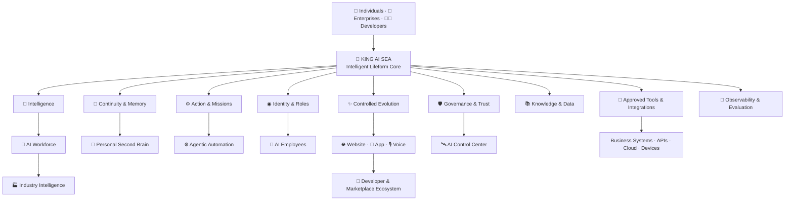

# 🧬 KING AI SEA — Public Intelligent Lifeform Architecture

> **A public, high-level architecture view of KING AI SEA.**  
> It explains what the intelligent lifeform can do and how major product layers relate, while intentionally protecting proprietary implementation, algorithms, routing, memory internals, evolution logic, privileged controls and production topology.

🌐 https://www.kingai.work  
✉️ vip@kingai.work

---

# English

## 1. The Intelligent Lifeform Is the Center

KING AI SEA is not a collection of disconnected AI tools.

The center of the platform is one persistent **Intelligent Lifeform Core**. AI employees, websites, applications, workflows, industry solutions and developer experiences are different ways that the same intelligent lifeform can operate in the digital world.



The diagram is intentionally conceptual. It describes **product relationships**, not internal implementation.

---

## 2. Public Lifeform Layers

### 🧠 Intelligence Layer
Publicly represents goal understanding, reasoning, planning, prioritization, interpretation and decision support.

It answers the question:

> **What is the owner trying to achieve?**

### 🧬 Continuity & Memory Layer
Publicly represents useful long-term context across people, projects, organizations, relationships, decisions and recurring operations.

It answers:

> **What should the lifeform remember so it does not start from zero?**

### ◉ Identity & Role Layer
Allows the intelligent lifeform to operate through different professional or personal roles with distinct responsibilities and permissions.

Examples include:

- personal assistant,
- executive intelligence,
- customer service,
- sales,
- marketing,
- operations,
- finance,
- HR,
- developer,
- DevOps,
- security,
- industry-specific roles.

### ⚙️ Action & Mission Layer
Represents the transition from understanding to real work.

Public capability categories include:

- one-time tasks,
- recurring tasks,
- event-driven work,
- long-running missions,
- multi-stage workflows,
- approval checkpoints,
- human handoff,
- follow-up and reporting.

### ✨ Controlled Evolution Layer
Represents the system's ability to become more useful and better aligned with its owner over time.

Public lifecycle language:

**Sense → Reflect → Propose → Validate → Evolve**

The implementation of evolution remains proprietary.

### 🛡️ Governance & Trust Layer
Represents owner-defined control over what the intelligent lifeform can see, recommend, prepare, execute, escalate or refuse.

Core public principle:

> **The automation scope, execution permissions and security boundaries of KING AI SEA are defined by the user or organization.**

---

## 3. External Capability Planes

The lifeform core can extend into multiple public product planes.

### 🤖 AI Workforce
A coordinated digital workforce around business objectives.

### 👔 AI Employees
Specialized professional expressions of the same KING AI SEA system.

### 👤 Personal Intelligence
A persistent second brain for an individual.

### 🌐 Website Intelligence
A website becomes an intelligent digital front door for discovery, service, sales, booking, support and conversion.

### 📱 Application Intelligence
Web apps, mobile apps, SaaS and internal systems gain a natural-language and agentic operating layer.

### ⚙️ Agentic Automation
Goals can continue across time through recurring, event-driven and long-running workflows.

### 🏭 Industry Intelligence
The same lifeform can be shaped for hospitality, logistics, property management, senior-care operations, healthcare administration, professional services, commerce, real estate, SaaS and other industries.

### 🧩 Developer & Marketplace Ecosystem
Developers and partners can extend the public platform through approved agents, skills, workflows, integrations and industry packages.

---

## 4. Supporting Platform Layers

### 📚 Knowledge & Data
Approved personal or enterprise knowledge, documents, records, business data and contextual information can support the lifeform's work.

### 🔌 Tools & Integrations
The system can connect, with authorization, to APIs, email, calendars, CRM, ERP, CMS, websites, applications, cloud platforms, Linux/VPS environments, databases, files and other digital systems.

### 📡 Observability & Evaluation
Public enterprise concepts include task state, activity history, approvals, quality, failures, cost, resource use, evaluation and outcome visibility.

### 🛰️ AI Control Center
A unified governance plane for supervising AI employees, tasks, missions, approvals, connected systems, cost, quality and deployment environments.

---

## 5. Unified Internal Pillars

KING AI SEA is the product/system. The following are internal pillars of that unified intelligent lifeform, not separate competing products:

- **Evolution OS** — the operating architecture of KING AI SEA.
- **SAE** — the controlled self-evolution mechanism within KING AI SEA.
- **ACRE** — the active defense / immune-system concept within KING AI SEA.
- **Root Policy Kernel** — the privileged policy and execution-boundary concept within KING AI SEA.

Only their public roles are described here. Their proprietary implementation remains private.

---

## 6. What This Repository Intentionally Does Not Reveal

Public documentation does not expose:

- internal system prompts,
- model-selection or routing logic,
- private orchestration logic,
- memory data structures,
- retrieval internals,
- SAE algorithms or scoring,
- evolution weights or validation internals,
- ACRE detection logic,
- Root Policy Kernel implementation,
- privileged execution controls,
- credential handling,
- secret storage,
- private API endpoints,
- internal database schemas,
- production infrastructure topology,
- proprietary automation scripts,
- core source code.

These are protected KING AI technologies.

---

## 7. Architectural Principle

### **One Intelligent Lifeform. Many Forms. One Owner-Defined Boundary.**

The system can become more capable, more connected and more useful over time while remaining governed by the permissions and boundaries defined by its owner.

---

# 中文

## 1. 整个体系的中心只有一个：KING AI SEA 智慧生命体

KING AI SEA 不是一堆互相独立的 AI 工具组合。

整个体系的中心是一个持续存在的 **智慧生命体核心**。

AI 员工、AI Workforce、个人第二大脑、智慧网站、AI-Native APP、自动化工作流、行业智能体以及开发者生态，全部都是同一个 KING AI SEA 智慧生命体在不同环境中的能力形态。

可以把公开架构理解为：

```text
                         👑 KING AI SEA
                           智慧生命体核心
                                │
       ┌──────────┬──────────┬──────────┬──────────┬──────────┐
       │          │          │          │          │          │
     🧠智慧      🧬记忆      ◉身份      ⚙️行动      ✨进化      🛡️治理
       │          │          │          │          │          │
       └──────────┴──────────┴────┬─────┴──────────┴──────────┘
                                  │
         ┌────────────┬───────────┼───────────┬────────────┐
         │            │           │           │            │
      🤖AI团队     👔AI员工     👤个人AI    🌐网站/APP   ⚙️自动化
         │            │           │           │            │
         └────────────┴───────────┼───────────┴────────────┘
                                  │
                📚知识 · 🔌工具 · 📡观测 · 🛰️控制中心
```

这只是公开产品关系图，不代表内部真实实现结构。

---

## 2. 智慧生命体六大公开核心能力

### 🧠 智慧
理解目标、上下文、优先级、关系和变化，并进行推理、规划与决策辅助。

核心问题：

> **主人真正想完成什么？**

### 🧬 连续性与长期记忆
围绕个人、企业、项目、客户、历史决策和持续运营保留有价值上下文。

核心问题：

> **哪些事情应该被记住，让智慧生命体不必每次从零开始？**

### ◉ 身份与角色
同一个智慧生命体可以根据场景表现为不同专业角色，并拥有不同职责和权限。

例如：

个人助理、企业管理助手、客服、销售、市场、运营、财务、HR、开发、DevOps、安全和行业专属角色。

### ⚙️ 行动与 Mission
从“理解”进入“执行”。

公开能力包括：

- 一次性任务
- 周期任务
- 条件触发任务
- 长时间 Mission
- 多阶段工作流
- 审批节点
- 人工接管
- 后续跟进
- 结果汇报

### ✨ 受控进化
KING AI SEA 的长期目标不是永远保持初始状态，而是在长期服务中越来越符合主人或企业的工作方式。

公开生命周期：

**Sense → Reflect → Propose → Validate → Evolve**

具体进化算法和实现不公开。

### 🛡️ 治理与安全边界
KING AI SEA 的自动化范围、执行权限与安全边界由使用者或企业定义。

可以围绕：

读取、分析、建议、草拟、执行、审批、升级、拒绝等不同级别建立控制。

---

## 3. 智慧生命体向外延伸的产品形态

### 🤖 AI Workforce
让智慧生命体成为企业数字劳动力组织层。

### 👔 AI 员工
让同一个智慧生命体通过专业岗位身份参与企业工作。

### 👤 Personal AI
让智慧生命体成为个人长期第二大脑和数字智慧伙伴。

### 🌐 Website AI
让网站从信息页面升级为可理解需求、服务客户、获客、销售和预约的智慧数字前台。

### 📱 App AI
让 SaaS、Web APP、手机 APP 和企业内部软件拥有自然语言操作和智能工作流能力。

### ⚙️ Agentic Automation
让目标可以跨时间持续推进，包括周期、事件触发、长任务和多阶段协作。

### 🏭 Industry Intelligence
围绕酒店、物流、物业、养老运营、医疗行政、专业服务、商业、地产、SaaS 等行业形成专属智慧生命体体验。

### 🧩 开发者与 Marketplace
让开发者、合作伙伴未来可以围绕 KING AI SEA 扩展 Agent、Skill、Workflow、Integration 和行业能力包。

---

## 4. 支撑能力层

### 📚 知识与数据
经过授权的个人知识、企业资料、文档、业务数据和运营信息可以成为智慧生命体理解与工作的依据。

### 🔌 工具与系统连接
经过授权后，可以连接 API、Email、Calendar、CRM、ERP、CMS、网站、APP、Cloud、Linux/VPS、数据库、文件和其他数字系统。

### 📡 可观测与评估
企业可以关注任务状态、执行记录、审批、质量、失败、成本、资源、评估和业务结果。

### 🛰️ AI Control Center
统一管理 AI 员工、Mission、任务、审批、系统连接、质量、成本和部署环境。

---

## 5. 统一系统内部支柱

KING AI SEA 才是完整产品与系统。

以下都是它内部的统一组成部分，而不是独立产品：

- **Evolution OS**：KING AI SEA 的操作架构。
- **SAE**：KING AI SEA 的受控自我进化机制。
- **ACRE**：KING AI SEA 的主动防御/免疫体系概念。
- **Root Policy Kernel**：KING AI SEA 的高权限策略与执行边界概念。

公开仓库只介绍它们承担什么角色，不公开它们具体怎么实现。

---

## 6. 公开仓库明确不披露的核心技术

不公开：

- 内部系统 Prompt
- 模型选择与路由逻辑
- 私有编排机制
- Memory 内部数据结构
- 检索实现
- SAE 算法与评分机制
- Evolution 权重与验证内部逻辑
- ACRE 检测逻辑
- Root Policy Kernel 具体实现
- 高权限执行控制机制
- 密钥和凭据管理
- 私有 API Endpoint
- 内部数据库结构
- 生产环境拓扑
- 私有自动化脚本
- 核心源码

这些全部属于 KING AI 受保护的核心技术。

---

## 7. 公开架构的最高原则

### **一个智慧生命体，多种能力形态，所有边界由主人定义。**

KING AI SEA 可以越来越智慧、越来越强、连接越来越多的数字世界，但它的权限和执行边界始终由使用者或企业定义。
