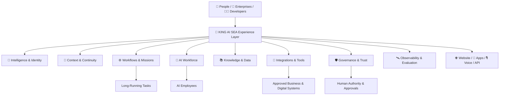

# 🧬 KING AI SEA — Public Platform Architecture

> A high-level public architecture map. It explains product layers and relationships without disclosing proprietary implementation, algorithms, credentials, routing logic or security internals.

🌐 https://www.kingai.work  
✉️ vip@kingai.work

---

# English

## Unified Intelligent-Lifeform Architecture

## Public Layers

### Experience Layer
Where people interact with KING AI SEA through web, app, voice, messaging, dashboards or APIs.

### Intelligence & Identity
Goal understanding, reasoning, role identity, coordination and decision support.

### Context & Continuity
Useful long-term context across users, projects, organizations and recurring operations.

### Mission & Workflow Layer
One-time, recurring, event-driven and long-running workflows with checkpoints and human participation.

### AI Workforce Layer
Specialized AI employees and multi-agent collaboration around defined responsibilities.

### Knowledge & Data Layer
Approved enterprise/personal knowledge, search, retrieval, reporting and business-data understanding.

### Integration Layer
Approved tools, APIs, enterprise systems, websites, applications, cloud services and external agent ecosystems.

### Governance & Trust Layer
Identity, permissions, approvals, policy, audit, environment boundaries and human authority.

### Observability & Evaluation Layer
Status, activity, quality, cost, latency, failures, approvals, testing and measurable outcomes.

### Presence Layer
Website, mobile app, SaaS, enterprise software, voice, messaging, dashboards, APIs and future agent networks.

## Evolution OS & SAE

Within the unified KING AI SEA system:

- **Evolution OS** is the operating architecture concept connecting identity, context, action, workflows, governance and feedback.
- **SAE** is the controlled self-evolution mechanism concept for improving usefulness through approved observation, reflection, validation and change.

Their proprietary implementation remains private.

## ACRE & Root Policy Kernel

Publicly:

- **ACRE** represents the active defense / immune-system security concept.
- **Root Policy Kernel** represents high-authority execution and policy boundaries.

Internal detection logic, policy-engine implementation and privileged security mechanisms are not publicly disclosed.

## Architectural Principle

**The intelligence may evolve. The authority remains defined by the owner.**

---

# 中文

## 统一智慧生命体公开架构

KING AI SEA 的公开架构可以理解为多个协同层，而不是单一聊天模型。

### 体验层
用户通过网站、APP、语音、消息、控制台或 API 与 KING AI SEA 互动。

### 智慧与身份层
负责目标理解、推理、角色身份、协调与决策辅助。

### 上下文与连续性层
围绕用户、项目、企业和长期运营保留有价值上下文。

### Mission / Workflow 层
支持一次性、周期性、事件驱动和长时间工作流，并支持检查点和人工参与。

### AI Workforce 层
多个专业 AI 员工按照职责和权限协同工作。

### 知识与数据层
连接经过授权的个人/企业知识、搜索、检索、报表和业务数据理解。

### 集成层
连接经过授权的 Tool、API、企业系统、网站、APP、云服务以及未来外部智能体生态。

### 治理与信任层
负责身份、权限、审批、策略、审计、环境边界和人类最终权力。

### 可观测与评估层
负责状态、活动、质量、成本、延迟、失败、审批、测试和业务结果衡量。

### 数字存在层
让 KING AI SEA 可以存在于网站、手机 APP、SaaS、企业软件、语音、消息、控制台、API 和未来智能体网络。

## Evolution OS 与 SAE

在统一 KING AI SEA 系统内部：

- **Evolution OS** 是连接身份、上下文、行动、工作流、治理和反馈的操作架构概念。
- **SAE** 是通过经过授权的观察、反思、验证和变化持续提高有用性的受控自进化机制概念。

具体专有实现不公开。

## ACRE 与 Root Policy Kernel

对外：

- **ACRE** 代表主动防御/免疫系统安全概念。
- **Root Policy Kernel** 代表高权限动作和策略边界。

内部检测逻辑、策略引擎实现以及高权限安全机制不公开。

## 架构原则

**智慧可以不断进化，但最终权力边界始终由使用者定义。**
