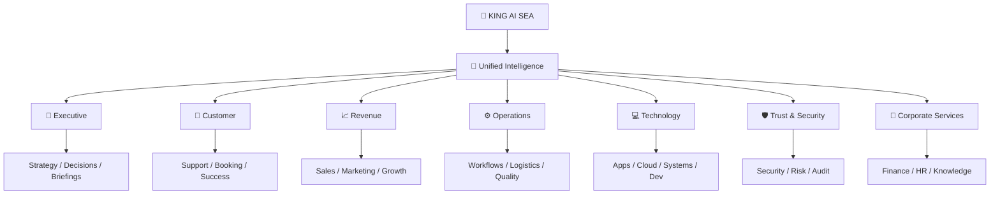

# 👑 KING AI SEA — Ultimate Intelligent Lifeform Platform

> **The flagship public blueprint for the KING AI intelligent-lifeform ecosystem.**  
> English first. Complete Chinese version follows.  
> This document describes public product capabilities and commercial architecture only. Proprietary implementation details are intentionally excluded.

🌐 Official Website: https://www.kingai.work  
✉️ Business & Partnership: vip@kingai.work

---

# ENGLISH

## 1. The Vision

KING AI SEA is designed as a unified intelligent-lifeform system for people, companies, developers, websites, applications, devices, workflows, and digital organizations.

It is not positioned as a single chatbot, a single agent, or a single automation product.

It is designed to become a persistent intelligence layer that can:

- 🧠 understand goals and operating context
- 🧬 retain useful long-term context
- 🧭 plan and coordinate multi-step objectives
- ⚙️ act through approved tools and systems
- 🛰️ observe approved events and operational signals
- 🤝 collaborate with humans and specialized AI roles
- 🛡️ operate inside owner-defined permissions and security boundaries
- 📈 learn from approved outcomes and improve over time
- 🌐 serve as intelligence inside websites, applications, business systems and digital services
- 🏢 form an enterprise AI workforce
- 👤 become a personal second brain
- 🧩 support specialized vertical-industry agents
- 🔌 interoperate with modern agent and tool ecosystems

### The core public promise

**Think · Remember · Act · Evolve**

### The strategic shift

Traditional software gives users features.  
Traditional AI gives users answers.  
KING AI SEA is designed to help users achieve outcomes.

---

## 2. One Unified System, Many Forms

KING AI SEA is one unified intelligent-lifeform system that can appear in different forms depending on the user and environment.

### 👑 Core Intelligent Lifeform
A persistent intelligence identity that can understand goals, coordinate capabilities, maintain approved context, and work across time.

### 👤 Personal Intelligence
A second brain, private digital assistant, project partner, knowledge companion, creator assistant, and life-operations layer.

### 🏢 Enterprise Intelligence
A business-wide intelligence layer that can coordinate departments, knowledge, workflows, systems, AI employees, monitoring and management.

### 🤖 AI Employees
Specialized digital roles for customer service, sales, marketing, operations, IT, security, finance, HR, executive support and vertical industries.

### 🌐 Website Intelligence
AI embedded into public websites for conversation, lead qualification, sales, support, booking, search, knowledge, conversion and service delivery.

### 📱 Application Intelligence
AI embedded into web apps, mobile apps, SaaS products and enterprise applications as a natural-language operating layer.

### 🧑‍💻 Developer Intelligence
A platform surface for builders to create custom agents, tools, workflows, integrations, skills and intelligent applications around KING AI SEA.

### 🏭 Industry Intelligence
Purpose-shaped experiences for hospitality, logistics, healthcare administration, property operations, professional services, commerce, education, technology, media and other industries.

### 🛒 Agent Marketplace & Ecosystem
A future distribution layer for approved agents, skills, workflows, integrations, templates and business solutions.

---

## 3. The KING AI Experience Layers

KING AI SEA can be understood publicly through twelve capability layers.

### 01 · Intelligence
Reasoning, understanding, planning, decision support, synthesis and multimodal interaction.

### 02 · Identity
Persistent roles, responsibilities, operating style and user/organization alignment.

### 03 · Memory & Context
Long-term useful context across people, projects, organizations, goals and recurring workflows.

### 04 · Action
Authorized execution through tools, APIs, digital systems, websites, applications and approved computing environments.

### 05 · Workflow
Multi-step processes, recurring operations, event-driven work, approvals, checkpoints and long-running tasks.

### 06 · Multi-Agent Collaboration
Specialized AI roles that can collaborate, delegate, review and coordinate around one objective.

### 07 · Communication
Text, voice, documents, images, reports, notifications and multi-channel interaction.

### 08 · Knowledge
Enterprise knowledge, personal knowledge, documentation, search, research and retrieval across approved information sources.

### 09 · Observation
Approved monitoring of systems, workflows, business signals, deadlines, events and exceptions.

### 10 · Governance
Permissions, approvals, policies, auditability, ownership, escalation and controlled execution.

### 11 · Evolution
Continuous improvement of usefulness, workflows, knowledge alignment and operating behavior through approved learning and evaluation.

### 12 · Presence
The ability to exist wherever the user works: website, app, dashboard, messaging, voice, API, server, business software and future agent networks.

---

## 4. Personal Intelligent Lifeform

KING AI SEA can become a private intelligence layer for an individual.

### Personal operating capabilities

- 🧠 personal second brain
- 📅 planning, calendar and priority coordination
- ✉️ email and communication assistance
- 📚 research and continuous learning
- 🗂️ knowledge, files, notes and documents
- 💼 personal business and project operations
- ✍️ writing, creativity and content
- 💻 technical and developer assistance
- 🌍 travel and decision support
- 💰 approved finance organization and reporting assistance
- 🏠 personal digital-life administration
- 🔔 proactive reminders and condition-based notifications
- 📈 goals, habits, milestones and review
- 🛰️ approved cross-service digital operations

The long-term goal is not another productivity app.

It is **one persistent digital intelligence that understands what matters to you and helps move life and work forward.**

---

## 5. Enterprise Intelligent Lifeform

For enterprises, KING AI SEA can serve as a unified intelligence layer across the organization.

### Enterprise-wide capabilities

- executive intelligence and operating briefs
- department-level AI employees
- internal knowledge intelligence
- customer experience automation
- sales and pipeline intelligence
- marketing and growth operations
- finance and reporting support
- HR and employee service assistance
- IT and infrastructure operations
- security awareness and incident assistance
- process automation and SOP execution
- business monitoring and exception detection
- project and portfolio coordination
- compliance-supporting workflows
- private deployment and governance
- multi-location and multilingual operations
- partner, supplier and customer workflow coordination

### The future operating model

**Human Leadership + Human Teams + AI Workforce + KING AI SEA**

KING AI SEA becomes the intelligence fabric connecting people, AI roles, workflows, knowledge and digital systems.

---

## 6. AI Employee System

AI employees are specialized operating identities inside KING AI SEA. They are not merely different prompts; they can be shaped around responsibilities, permissions, knowledge, tools, workflows and escalation rules.

### Executive & Management
- AI Chief of Staff
- Executive Briefing Agent
- Strategy & Research Agent
- Project Portfolio Agent
- Decision Support Agent

### Customer & Revenue
- AI Receptionist
- Customer Service Agent
- Sales Development Agent
- Account Support Agent
- Lead Qualification Agent
- Customer Success Agent
- Booking & Reservation Agent

### Growth
- Marketing Agent
- SEO/GEO Agent
- Content Agent
- Social Operations Agent
- Competitive Intelligence Agent
- Campaign Operations Agent

### Operations
- Operations Coordinator
- Workflow Agent
- Procurement Assistant
- Vendor Coordination Agent
- Logistics Operations Agent
- Scheduling Agent
- Quality & Exception Agent

### Technology
- Developer Agent
- DevOps Agent
- System Operations Agent
- Cloud Operations Agent
- Website Operations Agent
- Database Operations Assistant
- Technical Support Agent

### Trust & Security
- Security Operations Agent
- Audit Assistant
- Access Review Agent
- Incident Coordination Agent
- Risk Intelligence Agent

### Corporate Services
- Finance Operations Agent
- Invoice & Reconciliation Agent
- HR Service Agent
- Recruiting Assistant
- Onboarding Agent
- Internal Knowledge Agent

### Industry-Specific
Custom AI employees can be shaped around the terminology, workflows and responsibilities of a particular industry.

---

## 7. Intelligent Websites

A KING AI-enabled website can become more than static pages.

It can become a 24/7 intelligent digital front door.

### Public website capabilities

- conversational product discovery
- intelligent site search
- personalized content navigation
- lead capture and qualification
- customer-service assistance
- booking and appointment flows
- multilingual conversation
- product or service recommendations
- quote and inquiry preparation
- FAQ and knowledge assistance
- guided onboarding
- conversion assistance
- human escalation
- post-visit follow-up workflows
- analytics-ready conversation events

### Enterprise website intelligence

The same public interface can connect, within approved boundaries, to internal workflows so a customer request can become a qualified lead, support ticket, reservation request, sales follow-up, onboarding task or other structured business action.

---

## 8. Intelligent Applications

KING AI SEA can act as an intelligence layer inside applications.

### Web & Mobile Apps

Users can operate software through natural language instead of learning every menu and workflow.

Examples:

- “Show me what needs attention today.”
- “Create the report and send it for approval.”
- “Find customers at risk and prepare follow-ups.”
- “Explain why this metric changed.”
- “Create a task from this conversation.”
- “Check the system and summarize the issue.”

### SaaS Intelligence

Developers can add:

- AI copilots
- agentic workflows
- natural-language control
- embedded support
- AI onboarding
- business-process automation
- AI reporting
- workflow generation
- domain-specific assistants

### Internal Enterprise Apps

KING AI SEA can become a natural-language operating surface across approved internal applications, reducing friction between users and complex business systems.

---

## 9. Multi-Agent Digital Organization

A sophisticated deployment can include a coordinated digital organization.

The user or organization can interact with one unified KING AI experience while specialized roles operate behind the experience according to defined responsibilities and permissions.

---

## 10. Agent Interoperability & Connected Ecosystem

KING AI SEA is designed for a world where no single model, vendor, application or agent ecosystem will own every capability.

Public product direction therefore includes interoperability with modern patterns for:

- tool and data connections
- agent-to-agent collaboration
- APIs and webhooks
- enterprise connectors
- custom skills
- external services
- model-provider flexibility
- human approval systems
- event-driven workflows
- developer extensibility

Specific proprietary routing and orchestration logic is not publicly disclosed.

---

## 11. Voice, Vision & Multimodal Presence

The intelligent lifeform experience can extend beyond text.

Potential surfaces include:

- real-time voice conversations
- AI phone receptionist experiences
- voice customer service
- visual understanding
- document understanding
- image-based workflows
- screen-aware assistance
- multimodal reporting
- voice-enabled website and app experiences

The objective is a more natural relationship between humans and digital intelligence.

---

## 12. Computer & Digital Operations

Within approved environments and permissions, KING AI SEA can assist with real digital operations across software and computing environments.

Public capability categories may include:

- browser and web operations
- application workflows
- server and infrastructure assistance
- development environments
- file and document workflows
- deployment operations
- reporting systems
- internal tools
- cloud services
- approved enterprise systems

Every deployment should define its own boundaries, approvals and audit requirements.

---

## 13. Knowledge Intelligence

KING AI SEA can become the intelligence interface for an organization’s approved knowledge.

### Sources can include

- internal documentation
- policies and SOPs
- product information
- customer knowledge
- project records
- technical documentation
- research
- structured business data
- approved external information

### Experiences can include

- natural-language enterprise search
- question answering
- citation-ready knowledge summaries
- policy assistance
- decision context
- onboarding support
- recurring knowledge updates
- role-specific knowledge views

---

## 14. Proactive Intelligence

A mature agent system should not require the user to manually check everything.

KING AI SEA can support approved proactive experiences such as:

- deadline and schedule awareness
- system-health changes
- business KPI exceptions
- customer follow-up reminders
- new high-priority messages
- workflow failures
- security anomalies
- project blockers
- inventory or operational changes
- market or research updates
- recurring business reviews

Proactive behavior remains bounded by user-defined scope and notification rules.

---

## 15. Governance, Security & Human Authority

KING AI SEA is designed around operator control.

### Public governance principles

- explicit ownership
- scoped permissions
- least-necessary access
- approval gates for sensitive actions
- separation of responsibilities
- audit-ready activity records
- identity-aware actions
- reversible workflows where practical
- escalation to humans
- environment isolation where required
- secret and credential protection
- controlled external connections
- model and tool governance

### The governing principle

**Automation scope, execution permissions and security boundaries are defined by the user or organization.**

---

## 16. Observability & Quality

Enterprise-grade intelligence must be measurable.

Public product direction includes:

- agent activity visibility
- workflow status
- success/failure reporting
- latency and cost visibility
- tool-call visibility
- approval and escalation history
- quality evaluation
- regression testing
- operational dashboards
- incident and exception tracking

The objective is not invisible autonomy. It is **observable, controllable and continuously improvable intelligence.**

---

## 17. Deployment Spectrum

KING AI SEA can support a broad deployment spectrum:

- cloud
- dedicated VPS
- private cloud
- enterprise-controlled infrastructure
- hybrid cloud/private environments
- edge or local intelligence where appropriate
- multi-region enterprise deployments
- dedicated environments for regulated workflows

The right architecture depends on privacy, performance, integration, governance and business requirements.

---

## 18. Industry Solutions

KING AI SEA can be shaped into vertical intelligent-lifeform solutions for industries such as:

- hospitality and hotels
- logistics and transportation
- property management
- professional services
- healthcare administration
- senior-care administration
- retail and commerce
- restaurants and service businesses
- education and training
- media and content
- technology and SaaS
- real estate
- financial operations support
- legal operations support
- manufacturing operations
- field services
- travel and tourism

Each industry deployment should use industry-appropriate workflows, terminology, permissions and compliance requirements.

---

## 19. Agent Commerce

As agent-led commerce grows, KING AI SEA can support carefully governed commerce experiences such as:

- product and service discovery
- quote preparation
- reservation and booking workflows
- purchase-intent assistance
- procurement workflows
- invoice and payment-process assistance
- order and fulfillment coordination
- subscription and renewal workflows

Financial actions should use explicit authorization, appropriate controls and compliant payment infrastructure.

---

## 20. Developer & Builder Platform

KING AI SEA can support a developer ecosystem for building intelligent applications and specialized agents.

### Builder capabilities can include

- custom agent definitions
- role templates
- tool integrations
- API connections
- workflow templates
- knowledge connections
- custom skills
- event triggers
- approval workflows
- application embedding
- testing and evaluation
- deployment templates
- observability hooks
- agent-to-agent interoperability

The goal is to enable builders to create solutions on top of the KING AI SEA intelligence layer without exposing proprietary core technology.

---

## 21. Agent & Skill Marketplace

A future KING AI ecosystem can support discoverable, permission-aware extensions such as:

- AI employees
- industry agents
- skills
- workflow packs
- integrations
- automation templates
- business templates
- website agents
- app agents
- knowledge packs
- developer components

Marketplace assets should be permission-scoped, versioned, reviewed and transparent about what they can access or do.

---

## 22. Product Editions

All editions remain part of one KING AI SEA system.

### Personal
For individuals who want a persistent second brain and digital operating partner.

### Professional
For founders, creators, freelancers, consultants and independent operators.

### Business
For teams that need AI employees, customer operations, workflow automation and business intelligence.

### Enterprise
For organizations requiring private deployment, governance, complex integrations, multi-agent workforce and enterprise controls.

### Developer
For builders creating agentic products, integrations and custom intelligent applications.

### Industry
For vertical solutions shaped around a specific business domain.

---

## 23. Public Brand Positioning

### Primary
**KING AI SEA — The Intelligent Lifeform for People & Enterprises**

### Promise
**Think · Remember · Act · Evolve**

### Personal
**Your Second Brain. Your Digital Intelligence.**

### Enterprise
**Build an AI Workforce Around Your Business.**

### Developer
**Build Intelligent Experiences on a Persistent Agentic Foundation.**

### Website & Apps
**Turn Every Digital Experience Into an Intelligent Experience.**

---

## 24. What the Public Repository Does Not Reveal

This public repository does not disclose KING AI SEA proprietary internals, including but not limited to:

- private orchestration logic
- proprietary memory implementation
- privileged control mechanisms
- self-evolution internals
- internal security architecture
- production credentials
- private prompts
- proprietary model-routing policies
- internal policy-engine implementation
- unpublished infrastructure topology
- proprietary evaluation systems
- trade-secret workflows

The repository communicates the product vision, capabilities, use cases, deployment options, governance principles and ecosystem direction.

---

# 中文

## 1. KING AI SEA 的终极定位

KING AI SEA 是一个面向 **个人、企业、开发者、网站、APP、数字系统、工作流以及未来 AI 组织** 的统一智慧生命体系统。

它不是单一聊天机器人，也不是单一智能体，更不是一套普通自动化工具。

KING AI SEA 希望成为一个持续存在的数字智慧层，可以：

- 🧠 理解目标与运行环境
- 🧬 保留有价值的长期上下文
- 🧭 规划并协调复杂、多步骤目标
- ⚙️ 通过经过授权的工具和系统执行任务
- 🛰️ 感知经过授权的业务事件与运行信号
- 🤝 与人类以及不同专业 AI 角色协同
- 🛡️ 在用户设定的权限与安全边界内运行
- 📈 根据经过授权的结果不断提高长期价值
- 🌐 进入网站、APP、企业系统和数字服务
- 🏢 形成企业 AI Workforce
- 👤 成为个人第二大脑
- 🧩 支持各行业专业智能体
- 🔌 与现代智能体、工具和业务生态互联

### 核心品牌承诺

**会思考 · 会记忆 · 会行动 · 会成长**

传统软件给用户功能。  
传统 AI 给用户答案。  
KING AI SEA 希望帮助用户真正取得结果。

---

## 2. 一个统一智慧生命体，多种形态

KING AI SEA 始终是一套统一系统，只是在不同用户和环境中呈现为不同的智慧形态。

### 👑 核心智慧生命体
拥有持续身份，理解长期目标，协调能力，保留经过授权的有效上下文，并跨时间持续工作。

### 👤 个人智慧体
成为第二大脑、私人数字助理、项目伙伴、知识伙伴、创作伙伴和个人数字运营层。

### 🏢 企业智慧体
连接企业部门、知识、流程、系统、AI 员工、监控和管理的统一智慧层。

### 🤖 AI 员工
围绕客服、销售、市场、运营、IT、安全、财务、HR、管理和行业岗位形成专业数字角色。

### 🌐 网站智慧体
进入企业官网，承担对话、获客、销售、客服、预约、搜索、知识、转化和服务。

### 📱 APP 智慧体
进入 Web App、手机 App、SaaS 和企业软件，让用户通过自然语言直接操作业务系统。

### 🧑‍💻 开发者智慧平台
让开发者围绕 KING AI SEA 创建自定义智能体、工具、流程、集成、技能与智能应用。

### 🏭 行业智慧体
面向酒店、物流、地产、养老管理、专业服务、电商、教育、科技等行业形成专业解决方案。

### 🛒 智能体生态与市场
未来形成经过审核的 AI 员工、智能体、技能、工作流、集成、行业模板和业务方案分发体系。

---

## 3. 十二层智慧能力

### 01 · 智慧
理解、推理、规划、决策辅助、信息综合和多模态交互。

### 02 · 身份
长期角色、职责、行为方式以及与个人/企业的持续对齐。

### 03 · 记忆与上下文
围绕人、企业、项目、目标和重复工作流保留长期有效上下文。

### 04 · 行动
通过经过授权的工具、API、数字系统、网站、APP 和计算环境执行真实任务。

### 05 · 工作流
支持多步骤流程、周期性运营、事件驱动任务、审批、检查点和长时间任务。

### 06 · 多智能体协作
多个专业 AI 角色围绕一个目标进行协作、委派、检查和协调。

### 07 · 沟通
文字、语音、文档、图片、报告、提醒和多渠道交互。

### 08 · 知识
企业知识、个人知识、文档、搜索、研究和经过授权的信息检索。

### 09 · 感知
监控经过授权的系统、业务流程、截止时间、事件、状态和异常。

### 10 · 治理
权限、审批、策略、审计、责任归属、人工升级和受控执行。

### 11 · 进化
通过经过授权的学习和评估持续改善有用性、工作流和行为适应度。

### 12 · 数字存在
存在于用户真正工作的地方：网站、APP、控制台、消息系统、语音、API、服务器、企业软件以及未来智能体网络。

---

## 4. 个人智慧生命体

KING AI SEA 可以成为个人长期存在的数字智慧层。

能力包括：

- 🧠 个人第二大脑
- 📅 日程、计划、优先级协调
- ✉️ 邮件与沟通辅助
- 📚 研究和持续学习
- 🗂️ 文件、笔记、文档与知识管理
- 💼 个人业务与项目运营
- ✍️ 写作、创作和内容
- 💻 技术和开发辅助
- 🌍 出行与决策支持
- 💰 经授权的财务整理和报表辅助
- 🏠 个人数字生活管理
- 🔔 主动提醒与条件通知
- 📈 目标、习惯、里程碑和复盘
- 🛰️ 经授权的跨服务数字操作

目标不是再增加一个效率软件，而是：

**拥有一个真正理解什么对你重要，并长期帮助你把生活和工作向前推进的数字智慧体。**

---

## 5. 企业智慧生命体

对企业而言，KING AI SEA 可以成为贯穿组织的统一智慧层。

能力可以覆盖：

- 管理层经营智慧与摘要
- 部门级 AI 员工
- 企业内部知识智慧
- 客户体验自动化
- 销售与商机智慧
- 市场与增长运营
- 财务与报表辅助
- HR 与员工服务
- IT 与基础设施运营
- 安全感知与事件辅助
- SOP 与业务流程自动化
- 经营监控和异常识别
- 项目与项目组合协调
- 合规辅助流程
- 私有部署与治理
- 多地区、多语言运营
- 客户、供应商和合作伙伴工作流协调

### 未来企业模式

**Human Leadership + Human Teams + AI Workforce + KING AI SEA**

KING AI SEA 成为连接人类、AI 员工、业务流程、知识与数字系统的智慧网络。

---

## 6. AI 员工体系

AI 员工是 KING AI SEA 内部围绕具体岗位形成的专业智慧角色。它们不仅仅是不同提示词，而可以围绕职责、权限、知识、工具、工作流与人工升级规则进行配置。

### 管理层
AI Chief of Staff、管理摘要、战略研究、项目组合、决策支持。

### 客户与收入
AI 前台、客服、销售开发、客户支持、线索资格判断、客户成功、预约与预订。

### 增长
市场、SEO/GEO、内容、社媒运营、竞争情报、活动运营。

### 运营
运营协调、工作流、采购辅助、供应商协同、物流运营、排班、质量与异常处理。

### 技术
开发、DevOps、系统运维、云运维、网站运维、数据库辅助、技术支持。

### 安全与信任
安全运营、审计辅助、权限检查、事件协调、风险智慧。

### 企业职能
财务运营、发票与对账、HR 服务、招聘、入职、内部知识。

### 行业岗位
根据行业术语、流程、岗位和规则创建专业 AI 员工。

---

## 7. AI 智慧网站

KING AI 可以让网站从静态信息页升级为 7×24 小时在线的智慧数字入口。

能力可以包括：

- 对话式产品/服务发现
- 智慧站内搜索
- 个性化内容导航
- 获客与线索判断
- 客服辅助
- 预约和预订
- 多语言对话
- 产品或服务推荐
- 报价与询价准备
- FAQ 与企业知识回答
- 引导式新客流程
- 转化辅助
- 人工升级
- 访问后跟进
- 可分析的对话事件

客户在网站上的一句话，可以在经过授权的情况下进一步变成 CRM 线索、客服工单、预约请求、销售任务、入职流程或其他结构化业务动作。

---

## 8. AI 智慧 APP 与 SaaS

KING AI SEA 可以成为应用程序内部的智慧操作层。

用户不必学习每一个菜单，可以直接用自然语言操作：

- “告诉我今天最需要处理什么。”
- “生成这个月报并提交审批。”
- “找出可能流失的客户并准备跟进。”
- “解释为什么这个指标下降。”
- “把这段对话转换成任务。”
- “检查系统问题并给我结论。”

开发者还可以在 SaaS 或 APP 中加入 AI Copilot、智能工作流、自然语言控制、AI 客服、AI onboarding、业务自动化、AI 报表和行业助手。

---

## 9. 多智能体数字组织

一个高级企业部署可以形成完整的 AI 数字组织：

**KING AI SEA → 统一智慧 → 管理 / 客户 / 收入 / 运营 / 技术 / 安全 / 企业职能 → 各专业 AI 员工**。

用户只需要面对一个统一 KING AI，但背后可以由不同专业智慧角色根据职责和权限协同完成工作。

---

## 10. 智能体互联与开放生态

未来不会由某一个模型、厂商、软件或智能体体系垄断全部能力。

因此 KING AI SEA 的公开产品方向包括：

- 工具和数据连接
- 智能体之间协作
- API / Webhook
- 企业连接器
- 自定义技能
- 外部服务
- 多模型与多供应商适配
- 人工审批体系
- 事件驱动流程
- 开发者扩展

具体内部路由和调度实现属于专有技术，不在公开仓库披露。

---

## 11. 语音、视觉与多模态生命体

KING AI SEA 不应局限于文字。

可以扩展到：

- 实时语音
- AI 电话前台
- 语音客服
- 图像理解
- 文档理解
- 图片工作流
- 屏幕理解辅助
- 多模态报告
- 网站与 APP 语音交互

目标是让人与数字智慧的交互越来越自然。

---

## 12. 计算机与数字操作

在经过授权的环境和权限范围内，KING AI SEA 可以辅助操作：

- 浏览器与 Web
- 应用程序流程
- 服务器与基础设施
- 开发环境
- 文件与文档
- 部署流程
- 报表系统
- 企业内部工具
- 云服务
- 经授权的企业系统

不同部署需要分别定义权限、审批和审计要求。

---

## 13. 企业知识智慧

KING AI SEA 可以成为企业授权知识的统一智慧入口。

信息源可以包括内部文档、制度、SOP、产品资料、客户知识、项目资料、技术文档、研究资料、结构化业务数据和经过授权的外部信息。

员工可以直接通过自然语言获取企业知识、政策答案、业务背景、项目上下文和角色相关信息。

---

## 14. 主动智慧

成熟的智慧生命体不应该什么都等用户手动检查。

在用户授权范围内可以支持：

- 截止时间提醒
- 系统状态变化
- KPI 异常
- 客户跟进
- 高优先级消息
- 工作流失败
- 安全异常
- 项目阻塞
- 库存或运营变化
- 市场或研究更新
- 周期性经营复盘

主动行为仍由用户定义范围和通知规则。

---

## 15. 治理、安全与人类最终权力

KING AI SEA 的自动化范围、执行权限与安全边界由使用者设定。

公开治理原则包括：明确所有者、最小必要权限、敏感动作审批、职责分离、操作审计、身份感知、可恢复流程、人工升级、环境隔离、密钥保护、外部连接控制以及模型/工具治理。

---

## 16. 可观测与质量体系

真正的企业级智慧必须可测量、可检查、可改进。

可以提供：

- 智能体活动可见性
- 工作流状态
- 成功/失败报告
- 延迟和成本可见性
- 工具调用记录
- 审批与升级历史
- 质量评估
- 回归测试
- 运营控制台
- 异常与事件追踪

目标不是“看不见的自治”，而是：

**可观察、可控制、可持续优化的智慧。**

---

## 17. 全部署形态

KING AI SEA 可以覆盖：

- 云端
- 独立 VPS
- 私有云
- 企业自有基础设施
- 混合云 / 私有环境
- 合适情况下的本地或边缘智慧
- 多地区企业部署
- 针对敏感业务的独立环境

最终方案由隐私、性能、集成、治理和商业需求决定。

---

## 18. 行业智能体

可以面向以下行业形成行业智慧生命体：

酒店、物流、物业管理、专业服务、医疗行政、养老管理、零售电商、餐饮服务、教育培训、媒体内容、科技 SaaS、房地产、财务运营辅助、法律运营辅助、制造、现场服务、旅行与旅游等。

每个行业版本使用适合本行业的语言、流程、权限和合规边界。

---

## 19. Agent Commerce

随着智能体商业的发展，KING AI SEA 可以支持经过严格治理的商业能力，例如：

- 产品与服务发现
- 报价准备
- 预约和预订
- 购买意向辅助
- 企业采购流程
- 发票和支付流程辅助
- 订单与履约协调
- 订阅与续费流程

涉及资金的动作必须采用明确授权、适当控制和合规支付基础设施。

---

## 20. 开发者与 Builder 平台

KING AI SEA 可以形成开发者生态，让开发者构建自己的智能体应用和行业方案。

公开能力可以包括：

- 自定义 Agent 定义
- AI 岗位模板
- 工具集成
- API 连接
- 工作流模板
- 知识连接
- 自定义技能
- 事件触发
- 审批工作流
- APP 内嵌
- 测试评估
- 部署模板
- 可观测接口
- 智能体互联

开发者可以在不接触 KING AI 核心专有实现的情况下构建自己的解决方案。

---

## 21. Agent / Skill Marketplace

未来 KING AI 生态可以分发经过审核的：

- AI 员工
- 行业智能体
- 技能
- 工作流包
- 集成
- 自动化模板
- 商业模板
- 网站智能体
- APP 智能体
- 知识包
- 开发者组件

每个扩展都应该拥有清晰的权限、版本、审核和访问说明。

---

## 22. 产品形态

所有形态都属于同一个 KING AI SEA 系统，而不是彼此割裂的产品。

### Personal
个人第二大脑与私人数字伙伴。

### Professional
面向创业者、创作者、自由职业者、顾问和独立经营者。

### Business
面向需要 AI 员工、客户运营、流程自动化和经营智慧的团队。

### Enterprise
面向需要私有部署、复杂治理、深度集成和大规模 AI Workforce 的组织。

### Developer
面向开发智能体产品、集成和自定义应用的 Builder。

### Industry
面向具体垂直行业的专业化智慧生命体方案。

---

## 23. 品牌核心语言

**KING AI SEA — 面向个人与企业的智慧生命体**

**会思考 · 会记忆 · 会行动 · 会成长**

个人：**你的第二大脑，你的数字智慧。**

企业：**围绕你的企业建立一支 AI Workforce。**

开发者：**在持续存在的智慧基础之上构建下一代智能应用。**

网站与 APP：**让每一个数字入口都拥有智慧。**

---

## 24. 不公开的核心范围

公开仓库不会披露 KING AI SEA 的私有调度逻辑、专有记忆实现、高权限控制机制、自我进化内部实现、安全核心架构、生产凭据、私有提示、专有模型路由策略、内部策略引擎实现、未公开基础设施拓扑、专有评估体系和商业机密工作流。

公开仓库只负责向全球用户清晰表达：**我们是谁、能做什么、适合谁、如何部署、如何受控，以及这个智慧生命体生态将走向哪里。**
